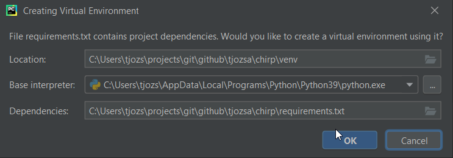

# Chirp - a Twitter Clone
This application is heavilly based on
[the Flask Mega-Tutoria by Miguel Grinberg](https://blog.miguelgrinberg.com/post/the-flask-mega-tutorial-part-i-hello-world).

The aim of this application is to support UI Automation testing.

## Run in Development
In order to pain and simple run this application you need to fetch the sources from this directory.

You will need `Python 3.8` or newer installed.

### Opening in Pycharm
For the first time when you open the project in Pycharm it may help you to create a python 3.8
virtual environment and install all the dependencies from requirements.txt.


You can allow Pycharm to do this or you can do this manually.

### Prepare Database
For the first time you must run the following command to create an SQLite file.
```commandline
(venv) $ flask db init
```

Then you must run the following two commands to populate the database.
```commandline
(venv) $ flask db migrate
```

```commandline
(venv) $ flask db upgrade
```

### Starting the Application
```commandline
(venv) $ flask run
```

There is no default User registered. You must register you own users.

## Running Unit Tests
```
(venv) $ python tests.py
```


## Error handling
You can adjust error handing with environment variables.

Depending on your operating system (windows SET linux EXPORT) use the comand to
export these environment variables
```
set FLASK_DEBUG=1 # to enable debug mode, default 0 --> nice/custom error pages + SMPT error sending
set MAIL_SERVER=localhost # to set SMTP server name
set MAIL_PORT=8025 # to set SMTP port
```

You can also run an SMPTD python mock SMTP server in another terminal.
```
(venv) $ python -m smtpd -n -c DebuggingServer localhost:8025
```

You will see mails sent in the mock terminal output.
