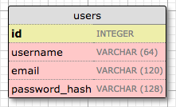
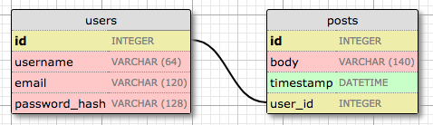
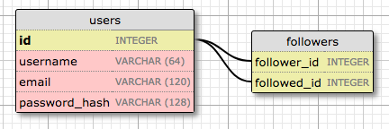

## Chirp's Database
We use Flask-SQLAlchemy and SQLite.

## Database Design
All database tables are generated by `SQLAlchemy`. The models are defined in `app/models.py` module.

### Users

The `id` field is usually in all models, and is used as the primary key.

The `username`, `email` and `password_hash` fields are defined as strings (or `VARCHAR` in database jargon), and their maximum lengths are specified so that the database can optimize space usage. While the username and email fields are self-explanatory, the `password_hash` fields deserves some attention. I want to make sure the application that I'm building adopts security best practices, and for that reason I will not be storing user passwords in the database. The problem with storing passwords is that if the database ever becomes compromised, the attackers will have access to the passwords, and that could be devastating for users. Instead of writing the passwords directly, I'm going to write password hashes, which greatly improve security. This is going to be the topic of another chapter, so don't worry about it too much for now.

## Posts

The posts table will have the required `id`, the body of the `post` and a `timestamp`. But in addition to these expected fields, I'm adding a `user_id` field, which links the post to its author.

## Representing Followers
The proper data model to track followers is the many-to-many relationship, because a user follows many users, and a user has many followers. But there is a twist. In the students and teachers example I had two entities that were related through the many-to-many relationship.

The followers table is the association table of the relationship. The foreign keys in this table are both pointing at entries in the user table, since it is linking users to users. Each record in this table represents one link between a follower user and a followed user.
